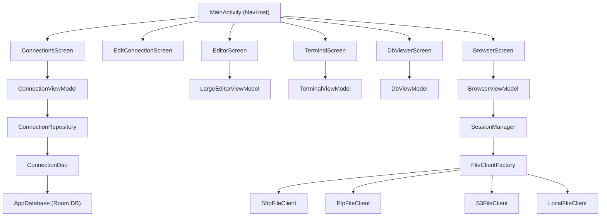

# YoursFTP 🌐📱

[](https://android.com)
[](https://kotlinlang.org)
[](https://developer.android.com/compose)
[](https://gradle.org)

Aplikasi Android tangguh berbasis **Kotlin + Jetpack Compose** dan **Material 3** untuk mengelola server remote Anda dengan mudah. Tidak hanya sekadar browser file FTP/SFTP, YoursFTP dilengkapi dengan berbagai alat bantu pengembang (*Developer Tools*) terintegrasi seperti **Terminal Emulator**, **Editor Teks Lanjutan**, dan **Penampil Database SQL & NoSQL**.

---

## 🚀 Fitur Utama

### 1. Manajemen Berkas & Multi-Protokol
* Dukungan koneksi lengkap untuk berbagai protokol industri:
  * **SFTP** (via JSch)
  * **FTP & FTPS** (via Apache Commons Net)
  * **Amazon S3** (Penyimpanan Objek Cloud)
  * **Local File System** (Penyimpanan Lokal Android)
* Manajemen profil koneksi tanpa batas menggunakan database **Room DB** lokal yang aman.
* Operasi file standar: navigasi direktori cepat, buat berkas/folder baru, ganti nama (*rename*), dan hapus (*delete*).

### 2. Terminal Emulator Interaktif (VT100/xterm)
* Jalankan perintah shell langsung di server remote Anda.
* Mendukung gamut warna penuh: **16-color, 256-color, hingga Truecolor (24-bit)**.
* Mendukung mode tampilan alternatif (alternate screen buffer) untuk menjalankan aplikasi berbasis terminal seperti `vim`, `htop`, atau `less`.
* Memiliki parser state-machine tangguh dengan riwayat scrollback hingga **5000 baris**.

### 3. Editor Teks Lanjutan (*Large File Editor*)
* Buka, edit, dan simpan kembali berkas teks berukuran besar secara instan ke server remote.
* Dilengkapi dengan **Syntax Highlighting** otomatis untuk berbagai bahasa pemrograman:
  * Kotlin, Java, Python, C/C++, Go, JavaScript, TypeScript, HTML, CSS, XML, JSON, CSV, Shell Script (`.sh`), YAML, dan konfigurasi lainnya.
* Menggunakan font monospace teroptimasi untuk keterbacaan kode yang maksimal.

### 4. Penampil Database Multi-Format (SQL & NoSQL)
Membaca berbagai format database langsung dari browser berkas tanpa aplikasi pihak ketiga:
* **SQLite (`.db`, `.sqlite`, `.sqlite3`, `.db3`, `.sqlitedb`)**: Menampilkan daftar tabel, baris data secara paginasi, dan eksekusi query SQL kustom penuh.
* **SQL Dump (`.sql`)**: Secara cerdas memuat isi dump SQL ke dalam database SQLite *in-memory* secara dinamis, menguraikan dialek (seperti MySQL backticks & auto-increment), dan mengekspos tabel untuk di-query.
* **JSON / NoSQL (`.json`, `.jsonl`, `.ndjson`, `.geojson`)**: Ekstraksi struktur baris-kolom otomatis dari JSON array, nested arrays, atau skema key-value global.
* **BSON (`.bson`)**: Dukungan pembacaan biner terstruktur berbasis skema JSON.
* **CSV / TSV (`.csv`, `.tsv`)**: Parsing tabel presisi sesuai standar RFC 4180 termasuk penanganan tanda kutip ganda dan baris baru di dalam field.
* **XML Data (`.xml`)**: Parsing otomatis tag bersarang sebagai baris tabel serta pembersihan namespace XML.

---

## 📐 Arsitektur Sistem

Aplikasi ini menggunakan pola arsitektur **MVVM (Model-View-ViewModel)** dengan alur data satu arah (*Unidirectional Data Flow*) yang clean:



---

## 📂 Struktur Direktori Proyek

```text
app/src/main/java/com/yoursftp/app/
├── MainActivity.kt                 # Navigasi & Entry Point UI utama
├── YoursFtpApp.kt                  # Inisialisasi Database Room & Aplikasi
├── data/                           # Layer Data (Room DB)
│   ├── AppDatabase.kt              # Room Database utama
│   ├── Connection.kt               # Model entitas profil koneksi
│   ├── ConnectionDao.kt            # Data Access Object untuk Room
│   ├── ConnectionRepository.kt     # Repositori akses data koneksi
│   ├── Protocol.kt                 # Enum protokol yang didukung
│   └── RemoteFile.kt               # Representasi berkas remote/lokal
├── transfer/                       # Logika Transfer Berkas & Klien
│   ├── FileClient.kt               # Antarmuka klien transfer
│   ├── FileClientFactory.kt        # Factory pembuat instance protokol
│   ├── FtpFileClient.kt            # Implementasi klien FTP & FTPS
│   ├── LocalFileClient.kt          # Klien untuk File System lokal
│   ├── S3FileClient.kt             # Klien penyimpanan objek AWS S3
│   ├── SftpFileClient.kt           # Klien protokol SFTP (via JSch)
│   ├── SessionManager.kt           # Pengelola sesi aktif
│   └── PathUtils.kt                # Utilitas pemrosesan path direktori
├── terminal/                       # Emulator Terminal
│   └── TerminalEmulator.kt         # Logic emulator terminal VT100/xterm
├── editor/                         # Editor Teks Lanjutan
│   ├── LargeEditorScreen.kt        # UI Komponen Editor Teks
│   ├── LargeEditorViewModel.kt     # VM pengelolaan dokumen teks besar
│   ├── SyntaxHighlight.kt          # Algoritma pewarnaan kode otomatis
│   └── TextDocument.kt             # Model representasi baris dokumen
├── db/                             # Fitur Penampil Database
│   ├── DbReader.kt                 # Abstraksi parser format DB
│   ├── SqliteReader.kt             # Pembaca SQLite
│   ├── JsonDbReader.kt             # Pembaca JSON & BSON
│   ├── CsvDbReader.kt              # Pembaca CSV & TSV
│   ├── SqlDumpReader.kt            # Pembaca berkas SQL Dump
│   ├── XmlDbReader.kt              # Pembaca berkas XML
│   ├── DbViewModel.kt              # ViewModel penampil database
│   └── DbViewerScreen.kt           # Layar tabel database Material 3
└── ui/                             # UI Global
    ├── screens/                    # Layar UI (Browser, Connections, Terminal)
    ├── theme/                      # Skema Warna & Tema Material 3
    └── *ViewModel                  # ViewModel untuk UI global
```

---

## 🛠️ Cara Membangun (Build) Proyek

Proyek ini menggunakan Gradle modern dan memerlukan setidaknya **JDK 17** serta **Android SDK (compileSdk 34)**.

### Metode 1: Menggunakan Android Studio (Sangat Direkomendasikan)
1. Buka Android Studio (versi Ladybug / Koala ke atas).
2. Pilih opsi **Open** dan arahkan ke folder root repositori ini.
3. Biarkan Android Studio menyelesaikan sinkronisasi Gradle (*Gradle Sync*).
4. Hubungkan perangkat Android fisik (lewat USB/Wi-Fi Debugging) atau gunakan Emulator.
5. Klik ikon **Run / Play** untuk memasang aplikasi.

### Metode 2: Menggunakan Terminal Command Line
Jika Anda ingin mengompilasi APK langsung dari terminal, jalankan perintah berikut:
```bash
# Membuat Gradle Wrapper jika belum ada
gradle wrapper --gradle-version 8.9

# Mengompilasi aplikasi ke format Debug APK
./gradlew assembleDebug
```
Setelah proses selesai, berkas APK terbaru dapat Anda temukan di:
`app/build/outputs/apk/debug/app-debug.apk`

---

## ⚠️ Catatan Keamanan & Batasan Penting
* **Koneksi SFTP**: Menggunakan konfigurasi `StrictHostKeyChecking=no` untuk mempercepat demonstrasi. Di lingkungan produksi, Anda disarankan untuk mendaftarkan *known hosts* demi mencegah serangan Man-in-the-Middle (MitM).
* **Penyimpanan Kredensial**: Password disimpan dalam database Room lokal. Untuk keamanan produksi, disarankan menggunakan database terenkripsi seperti **SQLCipher** atau memanfaatkan **Android Keystore**.
* **Keamanan Jaringan**: `usesCleartextTraffic=true` diaktifkan di manifest agar koneksi FTP standar (tanpa enkripsi SSL/TLS) tetap dapat diakses di Android versi modern.
